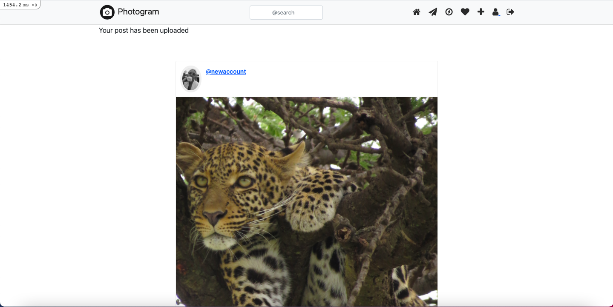
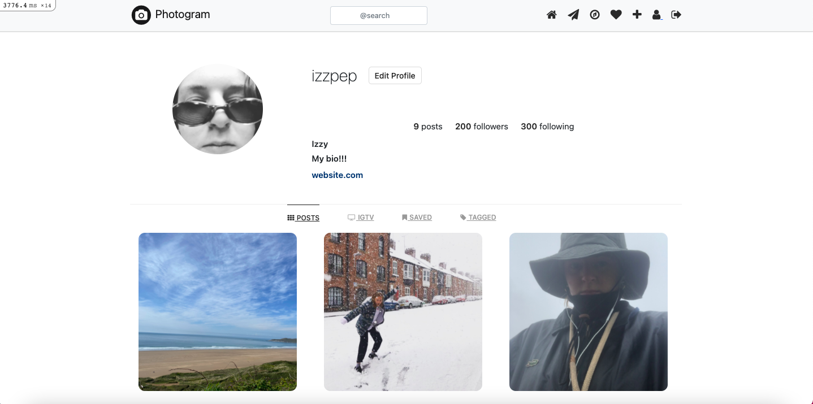
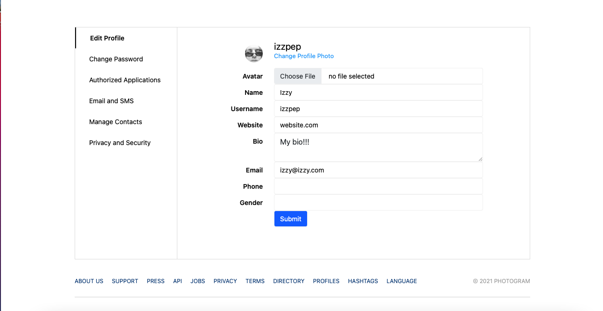
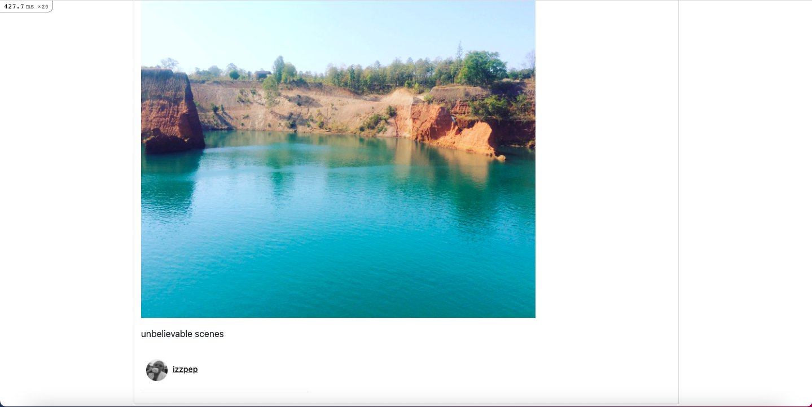
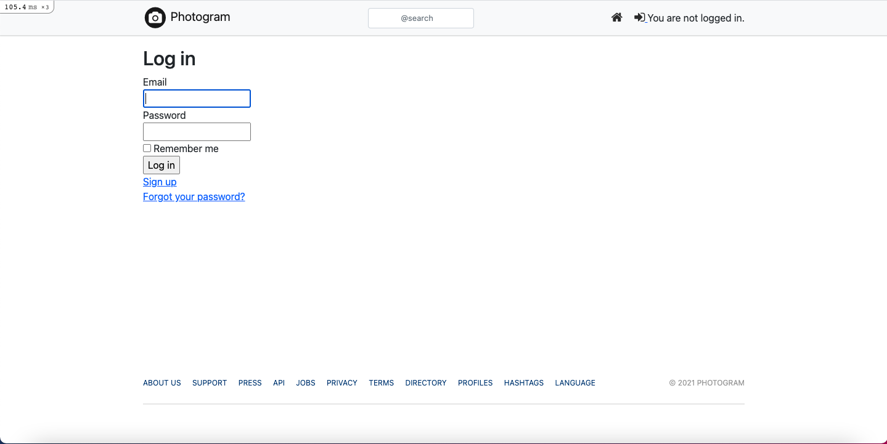

# README

## Instagram Clone

This challenge involves using rails as a framework to create a clone of   Instagram. My inspiration for styling of the app was obviously instagram but this blog on it (https://medium.com/luanotes/build-instagram-by-ruby-on-rails-part-1-fef7837ee399) was instrumental in my styling of the website. 

**Users**

- I started off this challenge by setting up the users, this includes:
  - Signing up, logging in and out
    - This was all set up through the devise gem
  - Having a unique user profile
   - This involves a user having an avatar, username, bio and website, all of which can be edited 
- I included the 'font-awesome-rails' gem in this project which has allowed me to create icons to navigate the website
  - In my navigation bar I have a home icon, messages icon, explore icon, profile icon, sign in/out icon and a search bar

Edge cases/things to consider further on in the project:
- Visting a profile shows the username instead of the user id in the url
- Clicking on another user's photo will take you to their profile
- You will not be able to edit anyone else's profile

**Posts**

- User can upload a post
  - Posts show on homepage with most recent post first
  - A users post will show on their profile
- User can upload an avatar
  - Avatar will show on home page next to username and above the picture
  - Avatar will also show on the user's profile
- Posts count gets updates on the user's profule
- Kaminari gem included so that home page has a pages function (new page after every five posts)

### Homepage

### User Profile Page

### Edit User Page

### Expand an Image

### Log in

**Outstanding Tasks**
- Create web helpers to clean up tests
- 'Edit profile' button is still on other user's profile (although you update your own profile from there not someone else's)
- Search function to search users and hashtags

